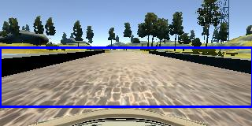

# Behavioral Cloning Project

[](http://www.udacity.com/drive)

Overview
---
This repository contains starting files for the Behavioral Cloning Project.

In this project, you will use what you've learned about deep neural networks and convolutional neural networks to clone driving behavior. You will train, validate and test a model using Keras. The model will output a steering angle to an autonomous vehicle.

We have provided a simulator where you can steer a car around a track for data collection. You'll use image data and steering angles to train a neural network and then use this model to drive the car autonomously around the track.

We also want you to create a detailed writeup of the project. Check out the [writeup template](https://github.com/udacity/CarND-Behavioral-Cloning-P3/blob/master/writeup_template.md) for this project and use it as a starting point for creating your own writeup. The writeup can be either a markdown file or a pdf document.

To meet specifications, the project will require submitting five files: 
* model.py (script used to create and train the model)
* drive.py (script to drive the car - feel free to modify this file)
* model.h5 (a trained Keras model)
* a report writeup file (either markdown or pdf)
* video.mp4 (a video recording of your vehicle driving autonomously around the track for at least one full lap)

This README file describes how to output the video in the "Details About Files In This Directory" section.

Creating a Great Writeup
---
A great writeup should include the [rubric points](https://review.udacity.com/#!/rubrics/432/view) as well as your description of how you addressed each point.  You should include a detailed description of the code used (with line-number references and code snippets where necessary), and links to other supporting documents or external references.  You should include images in your writeup to demonstrate how your code works with examples.  

All that said, please be concise!  We're not looking for you to write a book here, just a brief description of how you passed each rubric point, and references to the relevant code :). 

You're not required to use markdown for your writeup.  If you use another method please just submit a pdf of your writeup.

The Project
---
The goals / steps of this project are the following:
* Use the simulator to collect data of good driving behavior 
* Design, train and validate a model that predicts a steering angle from image data
* Use the model to drive the vehicle autonomously around the first track in the simulator. The vehicle should remain on the road for an entire loop around the track.
* Summarize the results with a written report

### Dependencies
This lab requires:

* [CarND Term1 Starter Kit](https://github.com/udacity/CarND-Term1-Starter-Kit)

The lab enviroment can be created with CarND Term1 Starter Kit. Click [here](https://github.com/udacity/CarND-Term1-Starter-Kit/blob/master/README.md) for the details.

The following resources can be found in this github repository:
* drive.py
* video.py
* writeup_template.md

The simulator can be downloaded from the classroom. In the classroom, we have also provided sample data that you can optionally use to help train your model.

## Details About Files In This Directory

### `drive.py`

Usage of `drive.py` requires you have saved the trained model as an h5 file, i.e. `model.h5`. See the [Keras documentation](https://keras.io/getting-started/faq/#how-can-i-save-a-keras-model) for how to create this file using the following command:
```sh
model.save(filepath)
```

Once the model has been saved, it can be used with drive.py using this command:

```sh
python drive.py model.h5
```

The above command will load the trained model and use the model to make predictions on individual images in real-time and send the predicted angle back to the server via a websocket connection.

Note: There is known local system's setting issue with replacing "," with "." when using drive.py. When this happens it can make predicted steering values clipped to max/min values. If this occurs, a known fix for this is to add "export LANG=en_US.utf8" to the bashrc file.

#### Saving a video of the autonomous agent

```sh
python drive.py model.h5 run1
```

The fourth argument, `run1`, is the directory in which to save the images seen by the agent. If the directory already exists, it'll be overwritten.

```sh
ls run1

[2017-01-09 16:10:23 EST]  12KiB 2017_01_09_21_10_23_424.jpg
[2017-01-09 16:10:23 EST]  12KiB 2017_01_09_21_10_23_451.jpg
[2017-01-09 16:10:23 EST]  12KiB 2017_01_09_21_10_23_477.jpg
[2017-01-09 16:10:23 EST]  12KiB 2017_01_09_21_10_23_528.jpg
[2017-01-09 16:10:23 EST]  12KiB 2017_01_09_21_10_23_573.jpg
[2017-01-09 16:10:23 EST]  12KiB 2017_01_09_21_10_23_618.jpg
[2017-01-09 16:10:23 EST]  12KiB 2017_01_09_21_10_23_697.jpg
[2017-01-09 16:10:23 EST]  12KiB 2017_01_09_21_10_23_723.jpg
[2017-01-09 16:10:23 EST]  12KiB 2017_01_09_21_10_23_749.jpg
[2017-01-09 16:10:23 EST]  12KiB 2017_01_09_21_10_23_817.jpg
...
```

The image file name is a timestamp of when the image was seen. This information is used by `video.py` to create a chronological video of the agent driving.

### `video.py`

```sh
python video.py run1
```

Creates a video based on images found in the `run1` directory. The name of the video will be the name of the directory followed by `'.mp4'`, so, in this case the video will be `run1.mp4`.

Optionally, one can specify the FPS (frames per second) of the video:

```sh
python video.py run1 --fps 48
```

Will run the video at 48 FPS. The default FPS is 60.

#### Why create a video

1. It's been noted the simulator might perform differently based on the hardware. So if your model drives succesfully on your machine it might not on another machine (your reviewer). Saving a video is a solid backup in case this happens.
2. You could slightly alter the code in `drive.py` and/or `video.py` to create a video of what your model sees after the image is processed (may be helpful for debugging).

### Tips
- Please keep in mind that training images are loaded in BGR colorspace using cv2 while drive.py load images in RGB to predict the steering angles.

# Writeup for submission

<p align="center">
  
</p>

**Dependencies**:
* `numpy`
* `sklearn`
* `csv`
* `keras` 
* `cv2`

## Model Architecture and Training Strategy
The model is structured as follows:

1. Load the data info from csv file
2. Extract images and zip them with measurements as the input for model
3. Apply `generator()` to shuffle and generate sample batches for training
4. Define CNN architecture
5. Set hyperparameters and start training

---

### Load and pre-process data
First write `loadSamples()` to load image paths and measurements

```
def loadSamples(sample_path):
    '''
    Loads the CSV sample data
    '''
    import csv
    samples = []
    with open(sample_path + '/driving_log.csv') as csvfile:
        reader = csv.reader(csvfile)
        for line in reader:
            samples.append(line)
    return samples
```

Then use `extractSamples()` to pick needed images for training
```
def extractSamples(samples, data_path):
    '''
    Extracts needed training data and corresponding measurements
    '''
    image_paths = []
    measurements = []
    for line in samples:
        image_paths.append(data_path + '/' +line[0])    # center_image column
        measurements.append(line[3])                    # steering column
    return image_paths, measurements
```

Then apply `generator()` for batching and generating more data for training
```
def generator(samples, batch_size=32):
    '''
    Generate shuffled batch samples on the fly
    '''
    num_samples = len(samples)
    while 1: # Loop forever so the generator never terminates
        samples = sklearn.utils.shuffle(samples)
        for offset in range(0, num_samples, batch_size):
            batch_samples = samples[offset:offset+batch_size]
            images = []
            steerings = []
            for image_path, measurement in batch_samples:
                image = cv2.imread(image_path)
                images.append(image)
                steerings.append(float(measurement))

                # Flip the image horizontally
                images.append(cv2.flip(image, 1))
                steerings.append(-1.0*float(measurement))
                
            X = np.array(images)
            y = np.array(steerings)
            yield sklearn.utils.shuffle(X, y)
```

---

### CNN architecture
For this model, the architecture designed by **Nvidia** is utilized as the end-to-end model.

More details can be found [here](https://images.nvidia.com/content/tegra/automotive/images/2016/solutions/pdf/end-to-end-dl-using-px.pdf).
<p align="center">
  
</p>

The model is implemented as follows:
```
def nvidiaCNN(input_shape):
    '''
    Define the Nvidia End-to-End CNN architecture
    '''
    from keras.models import Sequential, Model
    from keras.layers import Lambda, Cropping2D, Convolution2D, Flatten, Dense
    model = Sequential()
    model.add(Lambda(lambda x: (x / 255.0) - 0.5, input_shape=input_shape))
    model.add(Cropping2D(cropping=((60, 25), (0, 0))))
    model.add(Convolution2D(24, 5, 5, subsample=(2, 2), activation='relu'))
    model.add(Convolution2D(36, 5, 5, subsample=(2, 2), activation='relu'))
    model.add(Convolution2D(48, 5, 5, subsample=(2, 2), activation='relu'))
    model.add(Convolution2D(64, 3, 3, activation='relu'))
    model.add(Convolution2D(64, 3, 3, activation='relu'))
    model.add(Flatten())
    model.add(Dense(100))
    model.add(Dense(50))
    model.add(Dense(10))
    model.add(Dense(1))
    return model
```

Model summary:
```
Model: "sequential_1"
_________________________________________________________________
Layer (type)                 Output Shape              Param #   
=================================================================
lambda_1 (Lambda)            (None, 160, 320, 3)       0         
_________________________________________________________________
cropping2d_1 (Cropping2D)    (None, 75, 320, 3)        0         
_________________________________________________________________
conv2d_1 (Conv2D)            (None, 36, 158, 24)       1824      
_________________________________________________________________
conv2d_2 (Conv2D)            (None, 16, 77, 36)        21636     
_________________________________________________________________
conv2d_3 (Conv2D)            (None, 6, 37, 48)         43248     
_________________________________________________________________
conv2d_4 (Conv2D)            (None, 4, 35, 64)         27712     
_________________________________________________________________
conv2d_5 (Conv2D)            (None, 2, 33, 64)         36928     
_________________________________________________________________
flatten_1 (Flatten)          (None, 4224)              0         
_________________________________________________________________
dense_1 (Dense)              (None, 100)               422500    
_________________________________________________________________
dense_2 (Dense)              (None, 50)                5050      
_________________________________________________________________
dense_3 (Dense)              (None, 10)                510       
_________________________________________________________________
dense_4 (Dense)              (None, 1)                 11        
=================================================================
Total params: 559,419
Trainable params: 559,419
Non-trainable params: 0
_________________________________________________________________
```

For the cropping layer `Cropping2D(cropping=((60, 25), (0, 0)))`, output image looks like:
<p align="center">
  
</p>
which filters out the hood and sky in the image.

---

### Start training
Hyperparameters:
* [sample driving data](https://d17h27t6h515a5.cloudfront.net/topher/2016/December/584f6edd_data/data.zip) provided by Udaciy is used as training data (**8036** images)
* `AdamOptimizer` is chosen
* `batch_size` = 32
* `loss` is measured as Mean Squared Error
* `nb_epoch` = 3

Training result : 
```
Epoch 1/3
6428/6428 [==============================] - 3000s 467ms/step - loss: 0.0043 - val_loss: 0.0098
Epoch 2/3
6428/6428 [==============================] - 2988s 465ms/step - loss: 4.9076e-04 - val_loss: 0.0056
Epoch 3/3
6428/6428 [==============================] - 13583s 2s/step - loss: 3.0584e-04 - val_loss: 0.0067
```

---

### Discussion

* **Attempt to collect data**

I tried collecting data on my own, I recorded 4128 images on both tracks. Training result is as follows:
```
Epoch 1/10
3302/3302 [==============================] - 139s 42ms/step - loss: 0.0111 - val_loss: 0.0097
Epoch 2/10
3302/3302 [==============================] - 138s 42ms/step - loss: 0.0016 - val_loss: 0.0075
Epoch 3/10
3302/3302 [==============================] - 138s 42ms/step - loss: 0.0012 - val_loss: 0.0074
Epoch 4/10
3302/3302 [==============================] - 138s 42ms/step - loss: 8.9831e-04 - val_loss: 0.0073
Epoch 5/10
3302/3302 [==============================] - 138s 42ms/step - loss: 6.7842e-04 - val_loss: 0.0082
Epoch 6/10
3302/3302 [==============================] - 138s 42ms/step - loss: 5.5937e-04 - val_loss: 0.0072
Epoch 7/10
3302/3302 [==============================] - 138s 42ms/step - loss: 5.0075e-04 - val_loss: 0.0076
Epoch 8/10
3302/3302 [==============================] - 137s 42ms/step - loss: 4.1914e-04 - val_loss: 0.0079
Epoch 9/10
3302/3302 [==============================] - 137s 42ms/step - loss: 3.8760e-04 - val_loss: 0.0071
Epoch 10/10
3302/3302 [==============================] - 137s 42ms/step - loss: 3.7883e-04 - val_loss: 0.0078
```

The result looks fairly good but when I use the trained model to drive the vehicle, it performs poorly on sharp turns.

Reason behind this might be that I didnt record the data properly as I found it even hard for me to drive the car on the track all the time, especially for the second track.

So later I decided to try with the data provided by Udacity and it performs pretty well with it.

* **Flip the image**

With data provided by Udacity, it didnt go well on training at the beginning, validation error was alway much higher than training loss.

So I decided to flip the image and measurement horizontally in the `generator()`, so we can have doubled number of samples for training, it ended up well because it's not so **biased** to turning left as we recorded the data by driving counter-clockwise.

* **Using only center images**

The reason I chose not to use left and right image is because that tuning **correction** steering is hard, and it might add bias to the model.
